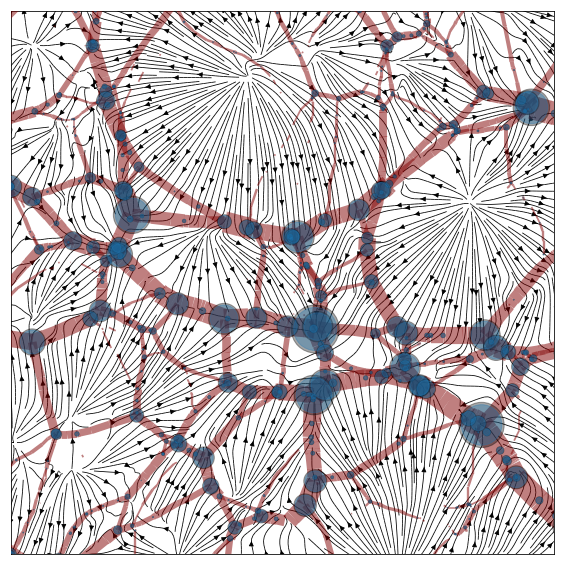

# adhesion-example
This is a short astrophysical program showing howto use weighted Voronoi tessellations compute the adhesion model, describing the large-scale structure of the Universe. This repository contains an example in C++ using [CGAL](www.cgal.org) and some examples in Python (using SciPy) offering more intuition into the method.

> This software emanates from NWO project 614.000.908 supervised by Gert Vegter and Rien van de Weygaert.

## Fair use
If you use this software in relation to a scientific project, please cite (at least) this repository through the following Zenodo link: [](https://zenodo.org/badge/latestdoi/36377754)
Also consider citing [doi:10.1145/2261250.2261316](https://doi.org/10.1145/2261250.2261316). A more complete paper (and thesis) outlining the methods used in this code is still in preparation.



## C++/CGAL code
This program is written in C++, using the 2011 standard. In addition to a recent GCC, to compile and run this example you need to have the development versions of the folowing libraries installed:
  * CGAL
  * FFTW 3.0

### features
The features are kept minimal:
  * Gaussian random fields: The program creates its own GRF to test the adhesion code on. This is the part of the program that depends on FFTW.
  * Glass initial conditions: Initial conditions are interpolated to a glass. This glass is generated on the fly, using Lloyd iteration. The Lloyd iteration makes use of periodic Voronoi tessellations.
  * Computing adhesion via the regular triangulation.
  * Selecting parts of the resulting web structures by either sphere or half-plane.
  * Writing output in ASCII to either Stanford PLY format or Wavefront OBJ. In the last case the density of sheets is written as a texture coordinate. This can be used when loading the OBJ to Blender (www.blender.org).

### building
To build this program, there is a bash make script included. Just typing:
 
 > ./make all
 
in the project folder will compile all .cc files in ./src and put the .o in a separate directory ./obj. The program is then linked to the executable, which is put in the project folder. If any dependancies are located outside the default search path, you can edit the top lines of the make script to change CFLAGS and LDFLAGS accordingly.

## Running the notebooks
To run the Python notebooks, make sure you have Python 3.5+ installed. It is recommended to create a virtual environment (or a conda environment) to run the notebooks in:

### requirements
Next to Python 3.5+:
  * NumPy 1.13
  * SciPy 0.19
  * Jupyter 1.0
  * Matplotlib 2.0

There is an additional notebook on computing constraint random fields, and one on running 2D n-body simulations,
these need:
  * gnuplot

### install
Go to a suitable project folder and create the VirtualEnv

```bash
> virtualenv -p python3 adhesion-env
> source ./adhesion-env/bin/activate
(adhesion-env) > pip install numpy scipy jupyter matplotlib
... # watch the wheels turn
> cd notebook
> jupyter notebook
... # browser window should open
```

To run in Jupyter notebook, also run the following:

```bash
jupyter labextension install @jupyter-widgets/jupyterlab-manager
jupyter labextension install ipyvolume
jupyter labextension install jupyter-threejs
```
